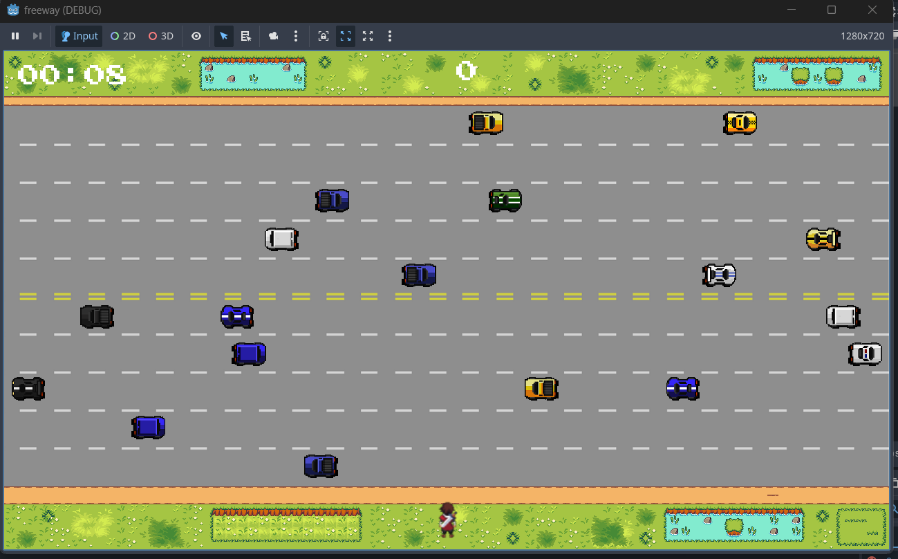
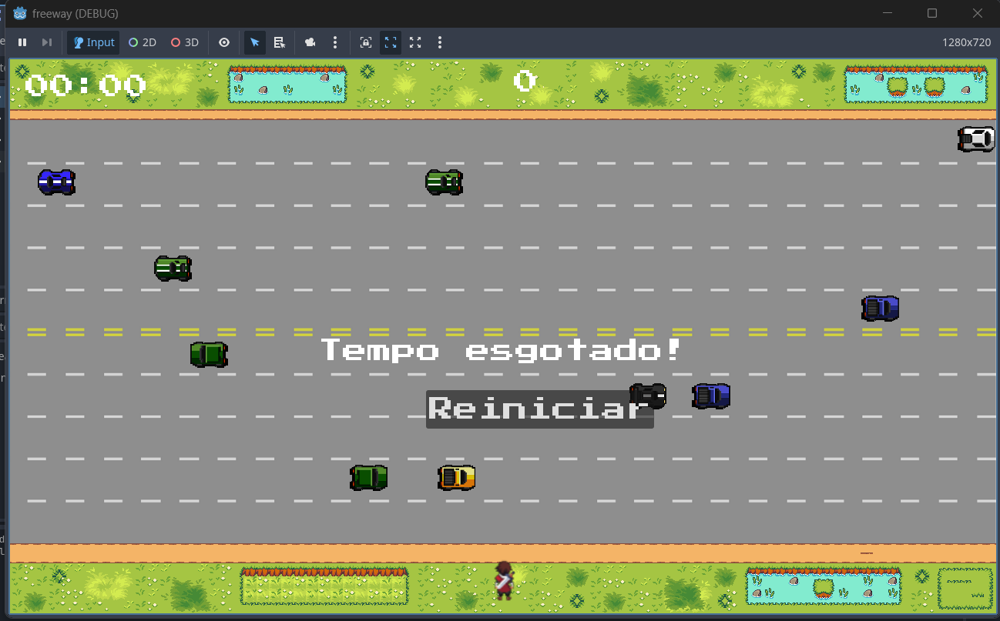
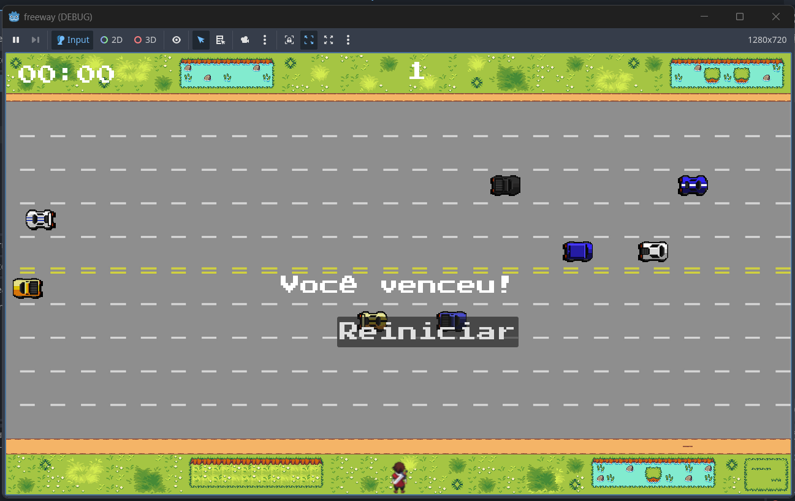

# 🛣️ Freeway Game (Godot)

Projeto desenvolvido no **Godot Engine**, inspirado no clássico *Freeway*.  
O objetivo é atravessar as pistas repletas de carros antes que o tempo acabe, somando pontos e evitando colisões.

---

## 🎮 Funcionalidades
- **Movimentação fluida do personagem**:  
  - 4 sprites para cada direção (cima, baixo, esquerda, direita).  
  - Animações responsivas às teclas pressionadas.  

- **Trânsito dinâmico**:  
  - Carros que se movimentam da esquerda para a direita e vice-versa.  
  - Pistas com diferentes velocidades (rápidas e lentas).  
  - Carros variados, sorteados aleatoriamente a cada spawn.  

- **Cronômetro e pontuação**:  
  - Tempo limite exibido no canto superior esquerdo.  
  - Cada travessia concluída soma **+1 ponto**.  
  - Vitória ou derrota exibida na tela:  
    - “⏳ Tempo esgotado!” → fim de jogo.  
    - “🏆 Você venceu!” → reiniciar e jogar novamente.  

- **Sistema de reinício**: botão interativo para recomeçar a partida.  

---

## 🖼️ Capturas de Tela
| Gameplay | Tempo Esgotado | Vitória |
|----------|----------------|---------|
|  |  |  |  

---

## 🛠️ Tecnologias Utilizadas
- [Godot Engine](https://godotengine.org/)  
- **GDScript** para a lógica do jogo.  
- Sprites personalizados, construídos manualmente bloco a bloco.  

---

## 📂 Estrutura de Códigos
- **carros.gd**: controla velocidade, direção e animação dos veículos.  
- **player.gd**: movimentação, animações e colisões do personagem.  
- **main.gd**: lógica principal do jogo (spawns, timers, placar e condições de vitória/derrota). - **hud.gd**: interface (mensagens, botões e reinício).  

---

## ▶️ Como Rodar
1. Clone este repositório:  
   ```bash
   git clone https://github.com/pinheiro-code/freeway-game.git
2. Abra a pasta no Godot Engine.
4. Clique em Run ▶️ para jogar.

